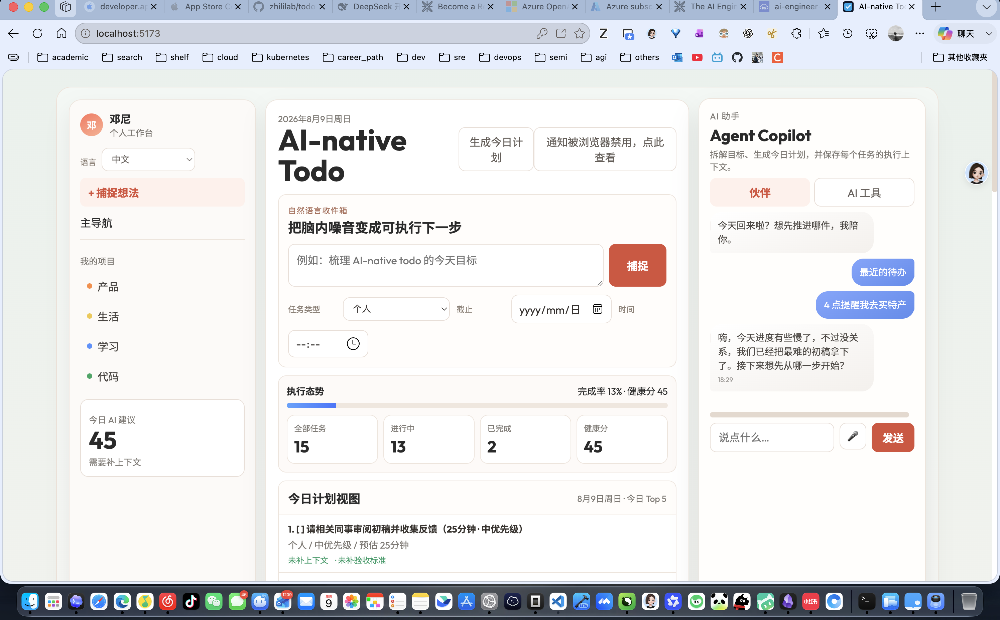

# AI-native Todo

一个支持任务类型、上下文、验收标准、AI 下一步 Prompt、今日计划与 Obsidian 导出的双语待办应用，Web 与 iOS 双端实现。

An AI-native bilingual todo app with task types, context fields, acceptance criteria, next-step prompts, today plan, and Obsidian export. Available on Web and iOS.

## 当前能力

- [x] 任务支持类型（Personal / Code / Product / Learning / Life）
- [x] 任务支持上下文字段（Context）
- [x] 任务支持验收标准（Acceptance Criteria）
- [x] 任务支持下一步 prompt（Next AI Prompt）
- [x] 一键导出 Obsidian Markdown（`todo-list-app-YYYY-MM-DD.md`）
- [x] 今日计划视图（Today Top 5 / 今日计划面板）
- [x] Web 与 iOS 双端支持分钟级截止时间和本地到期提醒
- [x] iOS 快速创建任务可从自然语言推断截止时间（如“今天 15:00”“3 小时后”）

## Repository

当前仓库名已统一为：`todo-list-app`

## 功能特性汇总（Web）

- **任务管理**：增删改查、完成状态切换、批量清除已完成；类型（个人/代码/产品/学习/生活）+ 状态（全部/进行中/已完成/高优先级）+ 优先级筛选排序；新增任务自动推断元数据（中文关键词推优先级、正则解析预估时长、按关键词推类型）
- **截止时间**：支持日期 + 精确到分钟的时间（`YYYY-MM-DD HH:mm`），到期判断、逾期高亮均为分钟级
- **健康度仪表盘**：完成率进度条 + 统计卡；健康分算法（完成度 45 + 上下文完备度 35 + 活跃负荷 20 − 高优先级积压罚分）；今日 Top 5 视图 + 下一步建议
- **AI 工作台**：8 家 OpenAI 兼容服务商（OpenAI/DeepSeek/Moonshot/Zhipu GLM/Qwen/Groq/SiliconFlow/Custom + 自定义）；智能拆解目标为 5-8 条可勾选任务并可一键导入、AI 复盘与下一步、AI 今日计划、任务行「拆小」；全部能力无 API Key 时自动本地降级
- **AI 路由（三层）**：有自定义 API Key → 直连服务商；无 Key 且配置托管代理 → 走 App 托管额度（`deepseek-v4-flash`，`X-Device-Id` 匿名计数，强制 `max_tokens=2048`）；两者都没有 → 本地降级
- **Companion（AI 温柔知己）**：对话聊天（人格设定 + 上下文打包 + 最近 40 条历史 + 记忆压缩）；关键时刻引擎（完成庆祝每日去重 + 逾期 3 天轻推）；建议动作流（严格 JSON 契约，白名单 `add_task/complete_task/breakdown`，写操作需用户点击确认）；无 AI 回复时从用户消息本地提取任务意图兜底；每日问候（带 Key 时后台换用 LLM 生成）；语音输入（Web Speech API，zh-CN/en-US 实时转写）；iMessage 风格气泡（双行时间戳、深浅区分、打字指示器）
- **法律与合规页面**：`privacy.html` / `terms.html` / `support.html`，中英双语、无脚本无表单，包含本地数据处理、匿名设备 ID、订阅条款（自动续订/取消）、支持邮箱
- **Obsidian 导出**：一键导出带 YAML frontmatter 的 Markdown 文件（含今日计划与任务上下文字段）
- **到期通知**：分钟级到期判断，到点发系统通知；60 秒轮询 + 去重标记，完成任务或改期自动清除标记
- **微交互**：统计数字 pop、完成任务高亮闪烁、删除任务淡出、逾期任务呼吸提醒、伙伴消息滑入、进度条 shimmer，全部支持 `prefers-reduced-motion`
- **其他**：中英双语（i18n 字典 + 本地化日期，持久化语言偏好）；PWA（favicon + webmanifest）；三栏响应式布局、键盘快捷键（⌘/Ctrl + Enter 快速添加）

## iOS 端功能特性（SwiftUI + SwiftData，iOS 17+，XcodeGen 工程）

与 Web 端为「逻辑镜像」移植（各模块注释标注与 web 逻辑一致），数据完全独立（SwiftData + UserDefaults），无后端、无跨端同步。

- **布局**：4-Tab 导航（今日计划 / 任务 / 伙伴 / 设置）；任务模型含上下文/验收标准/下一步 Prompt/来源目标；表单新增 + 自然语言捕捉（对齐 web 元数据推断）；编辑（TaskEditView）、删除/归档、清除已完成；状态筛选 + 优先级排序
- **AI 工作台**：智能拆解 / 复盘 / 今日计划，无 Key 自动本地降级；8 家兼容服务商注册表，兼容 `chat/completions` 与 `responses` 两种响应格式；无 Key 且配置托管代理时走 App 托管额度（`QuotaClient`，402 映射本地化提示）；**拆解目标选择器**（`AIGoalPicker`：可搜索、doing/todo 分组、优先级排序、直接输入入口）
- **Managed AI（生产配置）**：Release 只读 Info.plist `ManagedAIBaseURL`（Debug 可用 UserDefaults 覆盖），URL 校验（https、无凭据/查询）；Worker 端离线验签 App Store transaction JWT（Apple 根证书 pin）、App Store Server Notifications V2 回调、设备删除（`/internal/erase-device`）
- **Companion**：聊天 Tab（上下文打包 + 记忆压缩 + 历史 40 条）；关键时刻引擎（完成庆祝每日去重 / 逾期轻推）；建议动作流（白名单 + 批量入库）；每日问候可开关；语音输入（`SFSpeechRecognizer` + `AVAudioEngine`，zh-CN/en-US，双权限校验）；iMessage 风格气泡（`BubbleTailShape` + 打字指示器）
- **通知**：截止日期精确到分钟（DatePicker 日期 + 时分），按用户选择时刻触发并用 `UNTimeIntervalNotificationTrigger` 调度；过期任务补发间隔最小 60s；完成任务自动取消提醒；设置页展示授权状态
- **商业化**：7 天试用（过期自动降级）+ StoreKit 2 月/年订阅（`.v2` 商品 ID，与 Worker 白名单/ASC 一致）+ 恢复购买 + 交易监听；功能门控（AI 今日计划/高级 Obsidian 导出/任务模板/分析看板/主题包）；付费入口在设置页，试用结束后启动弹出自弹窗；出口合规声明（`ITSAppUsesNonExemptEncryption=false`）
- **App Store 发布准备**：中英双语提交材料（`ios/AppStoreConnect/`：申请 metadata、review notes、订阅文案、截图清单、数据删除 runbook、上架证据）；`TodoNative.storekit` 本地 IAP 测试配置；`PrivacyInfo.xcprivacy` 隐私清单
- **Obsidian 导出**：生成每日 Markdown，支持系统分享面板 + 复制剪贴板（付费功能）
- **体验**：动画全套尊重 `accessibilityReduceMotion`（完成打勾弹跳 + 闪光覆盖、按钮按压反馈、列表插入移除过渡、统计数字 pop、气泡滑入）；iPad 宽屏双栏；中英双语
- **质量**：369 个单元测试（33 个测试文件，覆盖模型 / 任务 VM / AI 计划 / Obsidian 导出 / 试用 / Companion / 通知 / 配额客户端 / goal picker / 工程配置 / 本地化），iOS 27 模拟器构建 + 启动冒烟通过

## 文件结构

```text
/
├── index.html            # UI + i18n 标记
├── styles.css            # 页面样式
├── app.js                # 任务管理 / AI 流程 / 多语言逻辑
├── companion-actions.js  # Companion 动作解析（JSON 契约 + 白名单）
├── companion-context.js  # Companion 上下文 / 记忆打包
├── companion-events.js   # 关键时刻引擎（庆祝 / 轻推）
├── companion-format.js   # 日期解析 / 逾期 / 通知判断
├── companion-quota.js    # AI 配额客户端（直连 / 代理路由决策）
├── companion-*.test.js   # 对应模块单元测试（node --test，142 个）
├── legal.css             # 隐私/条款/支持页样式
├── privacy.html          # 隐私政策（中英双语）
├── terms.html            # 服务条款（中英双语）
├── support.html          # 支持页（中英双语）
├── public/               # PWA 资源（favicon、site.webmanifest）
├── docs/                 # 设计文档与实现计划
├── scripts/              # 构建 / iOS 预览脚本
├── workers/quota-proxy/  # Managed AI Worker（配额 + App Store entitlement 离线验签 + DO 协调）
└── ios/                  # iOS 端（SwiftUI + SwiftData）
    ├── TodoNative/       # App 源码（Models / ViewModels / Views / Services / Configuration）
    ├── TodoNativeTests/  # 369 个单元测试
    ├── AppStoreConnect/  # App Store 提交材料（metadata / 截图 / 合规）
    ├── Project.yml       # XcodeGen 源码配置
    └── README.md         # iOS 规划与落地说明
```

## 快速开始

```bash
# Web：在项目根目录
python3 -m http.server
```

打开：`http://localhost:8000`

iOS 运行方式见 `ios/README.md`（`xcodegen generate` + Xcode 运行，或 `scripts/ios-preview.sh` 一键预览）。

## 在线部署

- Production: https://todo-list-app.zhili1993.chatgpt.site
- GitHub 仓库： https://github.com/zhililab/todo-list-app

### Legal and support pages / 法律与支持页面

本地预览前先构建，再启动预览服务：

```bash
npm run build
npm run preview
```

预览服务默认监听 `http://127.0.0.1:4173`；打开首页以及 `privacy.html`、`terms.html`、`support.html`，确认页脚链接和中英文锚点可用。生产站点由 Codex Sites 托管；部署时通过已授权的 Sites 发布流程更新构建产物，不要把托管凭据、API Key 或未验证的支持邮箱写入仓库。

## iOS 版本

- 当前状态与运行说明：`ios/README.md`
- 架构与订阅实现建议：`ios/Design/ios-architecture-plan.md`
- 多任务并行执行清单：`ios/Runbook/parallel-handoff.md`
- IAP 与发布清单：`ios/Runbook/iap-and-release-checklist.md`
- App Store Connect 提交材料：`ios/AppStoreConnect/`（双语元数据、App Privacy、审核备注、截图、订阅与发布证据）

> App Store 材料是工作稿，不等于已提交。Worker 端 entitlement 离线验签与 App Store Server Notifications V2 已实现并部署（Production/Sandbox，见 `ios/AppStoreConnect/release-evidence.md`）；生产 managed AI endpoint 已在 Release 配置。法律主体、copyright、实际价格、App Store Connect 合规选择与审核联系人仍需 owner 完成。

## 截图



上图为当前本地浏览器实拍（2026-08-09）；界面文字按正常布局渲染。截图资源随仓库提交，克隆后可直接预览，不依赖外部附件链接。

## 更新日志

- 2026-08-13：App Store 发布线：生产 managed AI endpoint（Release 只读 Info.plist）+ Worker entitlement 离线验签升级（Apple 根证书 pin、App Store Server Notifications V2、设备删除端点、Durable Object 强一致协调）；iOS 拆解目标选择器（AIGoalPicker）；中英双语法律页与提交材料；App Store 自动上传 CI（app-store-release.yml）；iOS 测试增至 369 个 / 33 文件。
- 2026-08-09：iOS 新增自然语言截止时间解析；快速创建任务可识别“今天 / 明天 / 后天”、时段与时刻、以及“X 小时 / 分钟后”，并自动安排本地提醒。同步新增解析测试，iOS 测试增至 104 个 / 14 个文件。
- 2026-08-09：新增 AI 配额系统（`workers/quota-proxy`：免费 10 条 / Pro 每日 20 条，KV 计数，`X-Device-Id` 匿名）；Web + iOS 双端接入 QuotaClient，Companion 新增语音输入（Web Speech / SFSpeechRecognizer）与 iMessage 风格气泡。
- 2026-08-08：支持精确到分钟的截止时间与到期提醒（Web + iOS 双端）；Companion 新增本地任务意图兜底；新增微交互与动画（双端，尊重系统减弱动态设置）。
- 2026-08-08：已补充网站 favicon 配置（Tab icon）并上线到 https://todo-list-app.zhili1993.chatgpt.site。
- 2026-08-08：新增 `site.webmanifest`，增强移动端/站点安装体验，图标统一使用高识别度专业 favicon。

## 配置说明

- 本地语言偏好与 API Key 会持久化到 `localStorage`
- `.env` 不需要配置（纯前端，API Key 在浏览器输入框中保存到本地）
- AI 托管额度代理（可选）：`workers/quota-proxy/` 部署后（KV namespace + `DEEPSEEK_API_KEY` secret），在 `localStorage.quota_base_url` 填入 Worker 地址即可启用；无 Key 用户自动走免费/Pro 配额（详见 `workers/quota-proxy/README.md`）

## 运行说明（English）

1. Start service: `python3 -m http.server`
2. Open `http://localhost:8000`
3. Add tasks, set task type/priority, fill context + acceptance criteria, run AI features if needed
4. Export to Obsidian Markdown for daily planning/archive
