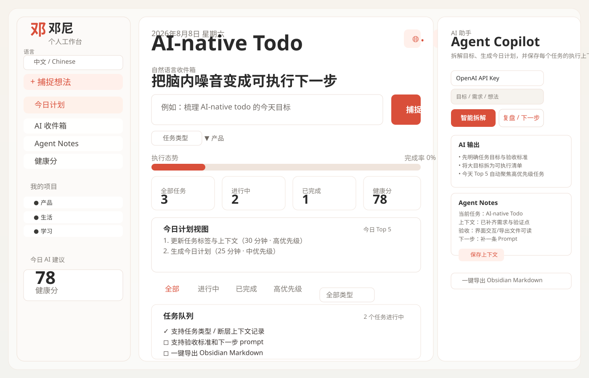
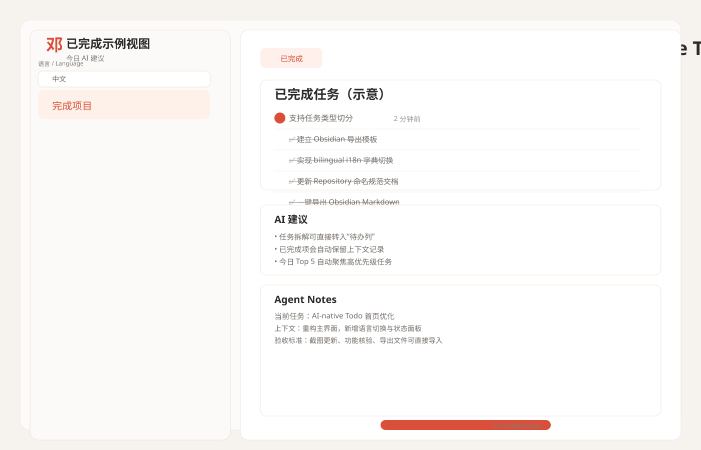

# AI-native Todo

一个支持任务类型、上下文、验收标准、AI 下一步 Prompt、今日计划与 Obsidian 导出的双语待办应用。

An AI-native bilingual todo app with task types, context fields, acceptance criteria, next-step prompts, today plan, and Obsidian export.

## 需求核对（按你的要求）

- [x] 任务支持类型（Personal / Code / Product / Learning / Life）
- [x] 任务支持上下文字段（Context）
- [x] 任务支持验收标准（Acceptance Criteria）
- [x] 任务支持下一步 prompt（Next AI Prompt）
- [x] 一键导出 Obsidian Markdown（`todo-list-app-YYYY-MM-DD.md`）
- [x] 今日计划视图（Today Top 5 / 今日计划面板）

## Repository

当前仓库名已统一为：`todo-list-app`

## 核心功能

- 支持中文 / English 两种界面（左侧语言切换）
- 任务类型、优先级、预估时长（类型会用于过滤和看板统计）
- 支持 AI 辅助：智能拆解、复盘、今日计划（无 API Key 自动本地降级）
- 健康分 + 下一步建议
- 一键导出 Obsidian Markdown

## 文件结构

```text
/
├── index.html       # UI + i18n 标记
├── styles.css       # 页面样式
├── app.js           # 任务管理 / AI 流程 / 多语言逻辑
└── README.md        # 项目说明
```

## 快速开始

```bash
# 在项目根目录
python3 -m http.server
```

打开：`http://localhost:8000`

## 截图

### Main



### Completed



## 配置说明

- 本地语言偏好与 API Key 会持久化到 `localStorage`
- `.env` 不需要配置（纯前端，API Key 在浏览器输入框中保存到本地）

## 运行说明（English）

1. Start service: `python3 -m http.server`
2. Open `http://localhost:8000`
3. Add tasks, set task type/priority, fill context + acceptance criteria, run AI features if needed
4. Export to Obsidian Markdown for daily planning/archive
